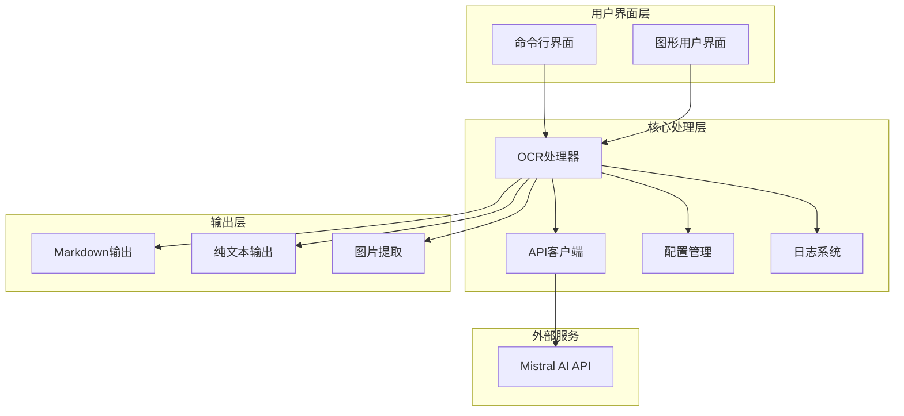
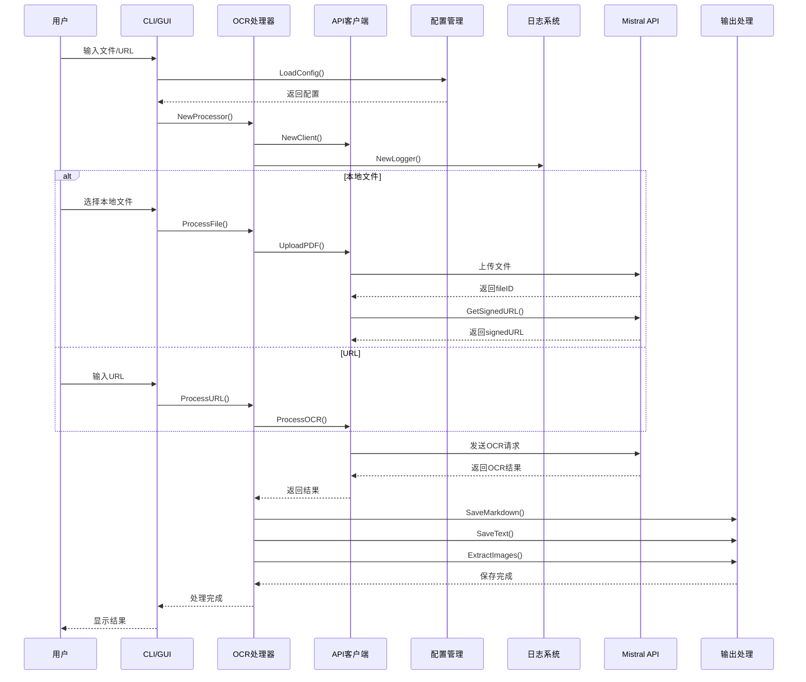

# Mistral OCR

使用Mistral AI的OCR API从PDF和图片中提取文本的工具，支持命令行和GUI界面。

## 功能

- 支持上传本地PDF文件并进行OCR处理
- 支持直接使用URL进行OCR处理
- 支持处理多个PDF文件或整个目录
- 支持多个API密钥和基础URL轮询，提高可靠性和负载均衡
- 保存OCR结果为Markdown和纯文本格式
- 提取和保存文档中的图片
- 提供CLI和GUI两种使用方式
- 详细的处理进度和日志记录

## 安装

### 从源码构建

```bash
# 克隆仓库
git clone https://github.com/nerdneilsfield/go-mistral-ocr.git
cd mistral-ocr

# 安装CLI工具
go install ./cmd/cli

# 构建GUI
cd cmd/gui
go build
```

### 使用发布版本

从[Releases](https://github.com/nerdneilsfield/go-mistral-ocr/releases)页面下载适合您操作系统的预编译二进制文件。

## 配置

首次运行时，应用会在`~/.config/mistral-ocr/config.toml`创建默认配置文件。您可以通过以下方式设置API密钥：

```bash
# 使用命令行设置
mistral-ocr config set-api-key YOUR_API_KEY

# 或在配置文件中设置多个API密钥和基础URL
# ~/.config/mistral-ocr/config.toml
api_keys = [
  "YOUR_API_KEY_1",
  "YOUR_API_KEY_2",
  "YOUR_API_KEY_3"
]

base_urls = [
  "https://api.mistral.ai/v1/",
  "https://api-alternative.mistral.ai/v1/"
]

# 或使用环境变量
export MISTRAL_API_KEY=YOUR_API_KEY
```

您也可以生成默认配置文件：

```bash
# 输出到标准输出
mistral-ocr config gen

# 保存到指定文件
mistral-ocr config gen -o ~/my-config.toml
```

## 命令行使用

### 基本用法

```bash
# 处理单个PDF文件
mistral-ocr file document.pdf

# 处理整个目录中的所有PDF文件
mistral-ocr file /path/to/directory

# 处理多个PDF文件和目录
mistral-ocr file document1.pdf document2.pdf /path/to/directory

# 处理URL
mistral-ocr url https://example.com/document.pdf
```

### 配置选项

```bash
# 使用自定义配置文件
mistral-ocr --config /path/to/config.toml file document.pdf

# 从命令行指定多个API密钥
mistral-ocr --api-keys="KEY1,KEY2,KEY3" file document.pdf

# 从命令行指定多个基础URL
mistral-ocr --base-urls="https://url1.com/v1/,https://url2.com/v1/" file document.pdf

# 指定输出目录
mistral-ocr --output-dir /path/to/output file document.pdf

# 不包含图片
mistral-ocr --include-images=false file document.pdf

# 自定义输出名称
mistral-ocr --output-name my-document file document.pdf
```

### 日志级别

```bash
# 设置日志级别 (debug, info, warn, error)
mistral-ocr --log-level debug file document.pdf
```

### 其他选项

```bash
# 空运行，不执行实际操作
mistral-ocr --dry-run file document.pdf

# 查看完整帮助
mistral-ocr --help
```

## 在其他程序中使用

您可以在自己的Go程序中直接导入OCR功能：

```go
import "github.com/nerdneilsfield/go-mistral-ocr/pkg/ocr"

// 创建OCR客户端，支持多个API密钥和基础URL
apiKeys := []string{"KEY1", "KEY2", "KEY3"}
baseURLs := []string{"https://api.mistral.ai/v1/", "https://api-alternative.mistral.ai/v1/"}
client := ocr.NewClient(apiKeys, baseURLs)

// 上传并处理PDF
fileID, _ := client.UploadPDF("/path/to/document.pdf")
signedURL, _ := client.GetSignedURL(fileID)
result, _ := client.ProcessOCR(signedURL, true)

// 或直接处理URL
result, _ := client.ProcessOCR("https://example.com/document.pdf", true)

// 处理多个文件或目录
processor := ocr.NewProcessor(client, logger)
results, _ := processor.ProcessMultipleFiles([]string{"/path/to/directory", "file1.pdf", "file2.pdf"}, opts)
```

## GUI使用

运行GUI应用程序：

```bash
mistral-ocr-gui
```

在GUI界面中：

1. 设置API密钥（如果尚未设置）
2. 选择要处理的PDF文件或输入URL
3. 配置处理选项
4. 点击"处理"按钮
5. 查看结果并打开输出目录

## 开发

### 系统架构



### 函数调用流程



### 目录结构

```
mistral-ocr/
├── cmd/                # 命令行和GUI入口点
│   ├── cli/            # CLI实现
│   └── gui/            # GUI实现
├── internal/           # 内部包
│   ├── config/         # 配置处理
│   └── logger/         # 日志设置
└── pkg/                # 公共包
    ├── ocr/            # OCR核心功能
    └── utils/          # 工具函数
```

### 构建和测试

```bash
# 构建CLI
go build -o bin/mistral-ocr ./cmd/cli

# 构建GUI
go build -o bin/mistral-ocr-gui ./cmd/gui

# 运行测试
go test ./...
```

## 许可

MIT